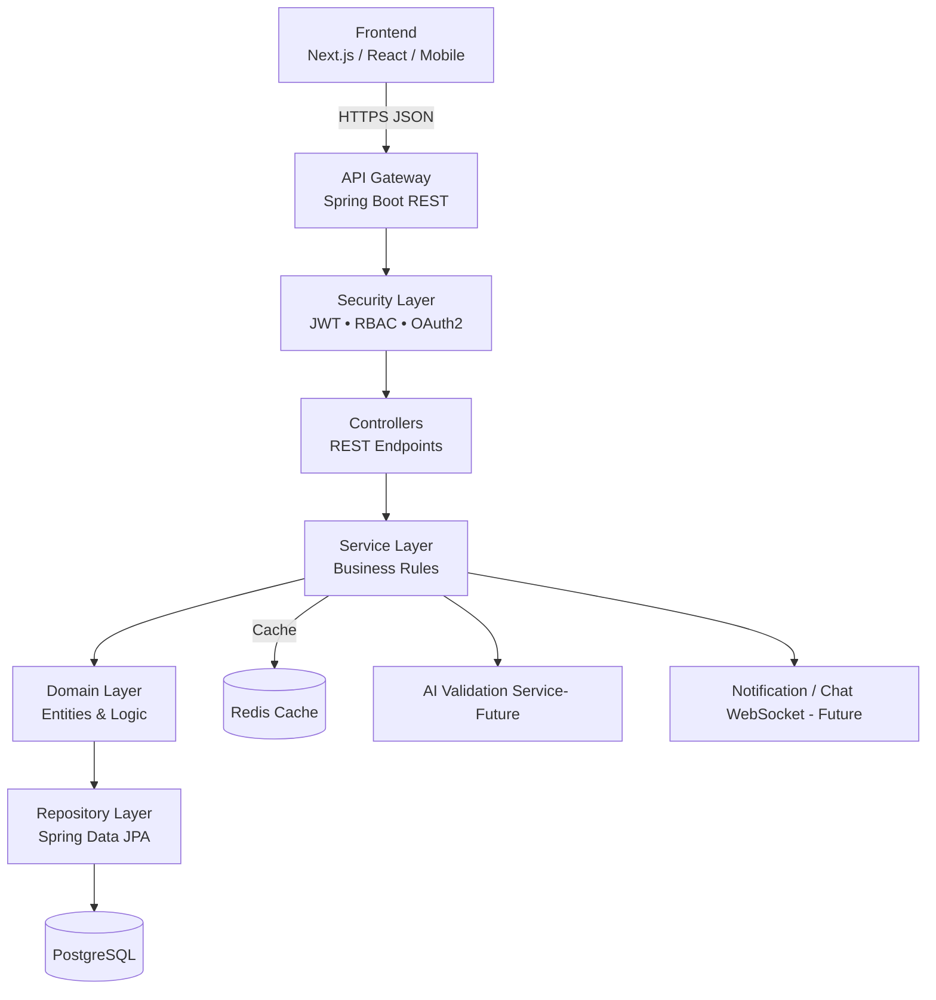

## English

# IdeaBridge Korea Backend

RESTful Backend API developed in Java using Spring Boot and Maven for the IdeaBridge Korea platform.

## 📋 Description

REST API that provides endpoints for managing users, problems, and solutions, connecting non-technical users with IT professionals.

## 🛠️ Technologies

- **Java 17**
- **Spring Boot 3.2.0**
- **Spring Data JPA**
- **Spring Security**
- **JWT (JSON Web Token)**
- **Maven**
- **H2 Database** (development)
- **PostgreSQL** (production)
- **Lombok**

## 📦 Prerequisites

- Java 17 or higher
- Maven 3.6 or higher
- PostgreSQL (for production) or H2 (included for development)

## 🚀 Installation and Execution

### 1. Clone the repository

```bash
cd ideabridge-backend
```
### 2. Configure the database

**Development (H2):**
- H2 is configured by default in `application.properties`
- H2 Console: http://localhost:8080/h2-console
- JDBC URL: `jdbc:h2:mem:ideabridgedb`
- User: `sa`
- Password: (empty)

**Production (PostgreSQL):**
Edit `application.properties`:
```properties
spring.datasource.url=jdbc:postgresql://localhost:5432/ideabridgedb
spring.datasource.username=seu_usuario
spring.datasource.password=sua_senha
spring.jpa.database-platform=org.hibernate.dialect.PostgreSQLDialect
```

### 3. Build the project

```bash
mvn clean install
```
### 4. Run the application

```bash
mvn spring-boot:run
``` 
- The API will be accessible at `http://localhost:8080`

## 📁 Project Structure
```bash
ideabridge-korea-backend/
├── src/
│   ├── main/
│   │   ├── java/com/ideabridge/   # Java source files
│   │   │   ├── controller/      # REST controllers
│   │   │   ├── service/         # Business logic services
│   │   │   ├── model/           # Entity models
│   │   │   ├── repository/      # Data repositories
│   │   │   ├── security/        # Security configurations
│   │   │   └── IdeabridgeKoreaApplication.java # Main application
│   ├── resources/                      
│   │   ├── application.properties  # Application configuration
│   │   └── data.sql                # Initial data for H2
├── pom.xml                        # Maven configuration
```
## 🔐 Authentication
```bash
The API uses JWT (JSON Web Token) for authentication.
- Register a new user via `POST /api/auth/register`
- Login via `POST /api/auth/login` to receive a JWT token
- Include the token in the `Authorization` header for protected endpoints
```
## 📄 API Endpoints
```bash
- `POST /api/auth/register` - Register a new user
- `POST /api/auth/login` - User login
- `GET /api/problems` - List all problems
- `POST /api/problems` - Submit a new problem
- `GET /api/problems/{id}` - Get problem details                
- `POST /api/problems/{id}/solutions` - Submit a solution to a problem
- `GET /api/users/{id}` - Get user profile
```
## 🗺️ Architecture Diagram

## 📄 License
```bash
This project is an MVP version.
```

## Korean
한국어 번역은 README.KO.md 파일을 참조하세요.


## 🤝 Contributing
Contributions are welcome! Please fork the repository and create a pull request with your changes.
```

