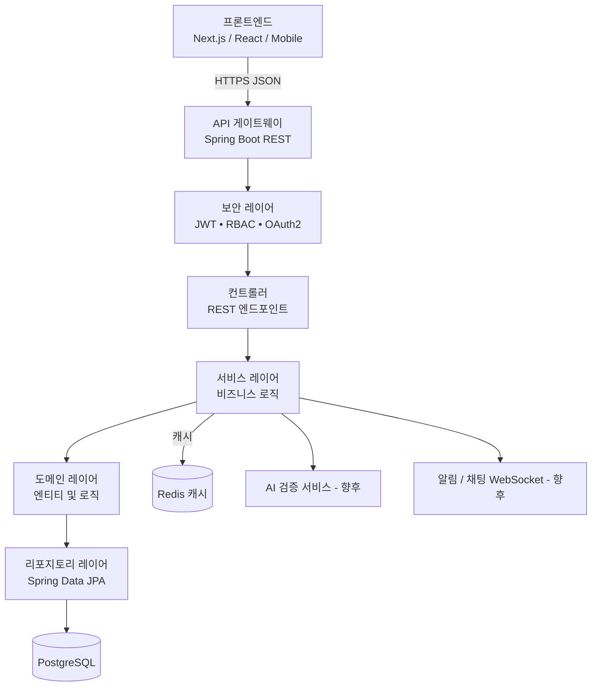

## 한국어 (Korean)

# IdeaBridge Korea Backend

IdeaBridge Korea 플랫폼을 위한 Java(Spring Boot, Maven 기반) RESTful 백엔드 API입니다.

## 📋 설명

비기술 사용자와 IT 전문가를 연결하여 사용자, 문제 및 솔루션 관리를 위한 엔드포인트를 제공하는 REST API입니다.

## 🛠️ 기술 스택

- **Java 17**
- **Spring Boot 3.2.0**
- **Spring Data JPA**
- **Spring Security**
- **JWT (JSON Web Token)**
- **Maven**
- **H2 Database** (개발 환경)
- **PostgreSQL** (운영 환경)
- **Lombok**

## 📦 사전 요구사항

- Java 17 이상
- Maven 3.6 이상
- PostgreSQL (운영용) 또는 H2 (개발용 포함)

## 🚀 설치 및 실행

### 1. 저장소 클론

```bash
cd ideabridge-backend
```
### 2. 데이터베이스 설정
**개발 환경 (H2):**
- `application.properties`에 기본 설정되어 있습니다.
- H2 콘솔: http://localhost:8080/h2-console
- JDBC URL: `jdbc:h2:mem:ideabridgedb`
- 사용자: `sa`
- 비밀번호: (빈 값)
- **운영 환경 (PostgreSQL):**
- `application.properties` 파일을 수정하세요:
```properties
spring.datasource.url=jdbc:postgresql://localhost:5432/ideabridgedb
spring.datasource.username=your_username
spring.datasource.password=your_password
spring.jpa.database-platform=org.hibernate.dialect.PostgreSQLDialect
```
### 3. 프로젝트 빌드

```bash
mvn clean install
```
### 4. 애플리케이션 실행    
```bash
mvn spring-boot:run
```
## 📡 API 엔드포인트
- 기본 URL: `http://localhost:8080/api`
- Swagger UI: `http://localhost:8080/swagger-ui.html` (설정된
- 엔드포인트 문서화)
- 예: `http://localhost:8080/api/users`, `http://localhost:8080/api/problems`
- 인증: JWT 토큰 사용
- 자세한 내용은 Swagger UI 참조
- ## 🔐 보안
- Spring Security 및 JWT를 사용하여 인증 및 권한 부여 구현
- 역할 기반 액세스 제어(RBAC) 적용

- ## 📁 프로젝트 구조

```bash
- ideabridge-korea-backend/
- ├── src/
- │   ├── main/
- │   │   ├── java/com/ideabridgekorea/
- │   │   │   ├── controller/      # 컨트롤러
- │   │   │   ├── service/         # 서비스
- │   │   │   ├── model/           # 도메인 모델
- │   │   │   ├── repository/      # 리포지토리
- │   │   │   ├── security/        # 보안 구성
- │   │   │   ├── IdeabridgeKoreaBackendApplication.java # 메인 애플리케이션
- │   ├── resources/
- │   │   ├── application.properties # 애플리케이션 설정
- ├── pom.xml                       # Maven 종속성 관리

```

## 📊 아키텍처 다이어그램


## 📄 라이선스

```bash
본 프로젝트는 MVP 버전입니다.
```

